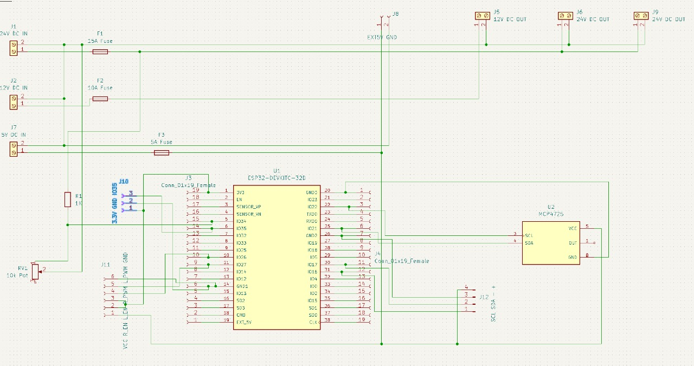
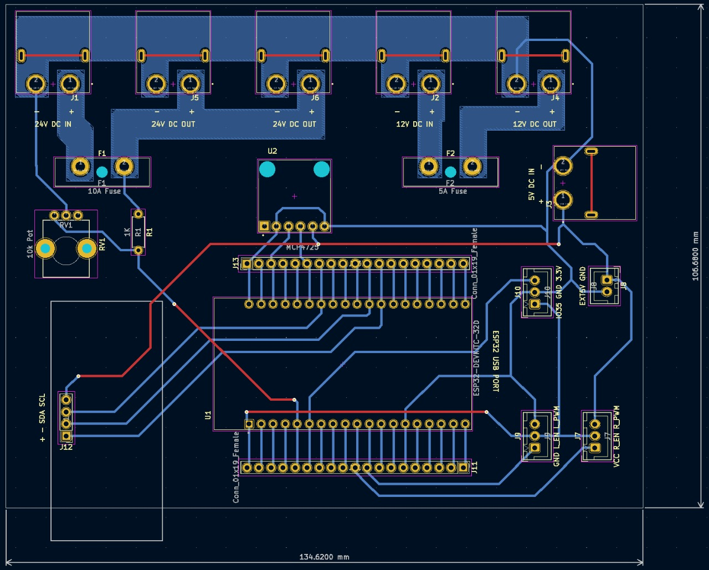

# Open Podcar 2.0

This is a project extended from [OpenPodcar](https://github.com/OpenPodcar/OpenPodcar).

We have changed components and improved the PCB layout to allow more flexibility in the system and ensure safty while operating the car.

## Linear Actuator Demostration
A demostration of controlling the linear actuator with the joystick which pass the steer command to the ESP32 through ROS using Wi-Fi is shown as follows.

[IMG_9704.MOV](./ReadmeDocs/IMG_9704.MOV)

## PCB design
The final schematic of the PCB is shown as follows.

The layout of the PCB at the current stage is shown as follows.

## Bill of Materials

#### Vehicle
1 Gimson Robotics GLA750-P 12V DC linear actuator with position feedback (100mm stroke)

Metal bracket [linik to product](https://www.amazon.co.uk/dp/B08JV76967?ref_=cm_sw_r_apin_dp_HXTQEXMHK0DS5XG23BHY)

#### PCB

1 ESP32 [link to product](https://www.amazon.co.uk/XTVTX-Development-Wireless-Bluetooth-Frequency/dp/B09LCDJY8Z/ref=sr_1_5?crid=2XLMJ0XECAAJR&keywords=esp32&qid=1669377505&s=industrial&sprefix=esp32%2Cindustrial%2C95&sr=1-5)

1 DollaTek BTS7960 5.5V to 27V 43A High Power Motor Driver [link to product](https://www.amazon.co.uk/gp/product/B09H6MKWCJ/ref=ppx_yo_dt_b_asin_title_o00_s00?ie=UTF8&psc=1)

1 Digital to Analog Converter [link to product](https://www.digikey.co.uk/en/products/detail/sparkfun-electronics/BOB-12918/5140812?utm\_adgroup=Evaluation%20Boards%20-%20Digital%20to%20Analog%20Converters%20%28DACs%29&utm\_source=google&utm\_medium=cpc&utm\_campaign=Shopping\_Product\_Development%20Boards%2C%20Kits%2C%20Programmers&utm\_term=&productid=5140812&gclid=CjwKCAiAs8acBhA1EiwAgRFdw7jZpmNLCZSMikVMd7oKKiSc0wkz7JpF8sl4ogsQpp6ZFNUjAHO2KBoC\_PIQAvD_BwE)

1 Buck Converter Module 24V to 12V 15A [link to product](https://www.amazon.co.uk/dp/B01KQWWSLA/)

1 Buck Converter Module 12V to 5V 5A [link to product](https://www.amazon.co.uk/dp/B09NVZ6Y6J?ref_=cm\_sw\_r\_apin\_dp_F5CDBP8B0AESHGP8G7D0)

JST-XH connector [link to product](https://www.amazon.co.uk/YIXISI-460Pcs-Housing-Connector-Adapter/dp/B082ZLYRRN/ref=asc_df_B082ZLYRRN/?tag=googshopuk-21&linkCode=df0&hvadid=394317030617&hvpos=&hvnetw=g&hvrand=13959213679084324666&hvpone=&hvptwo=&hvqmt=&hvdev=m&hvdvcmdl=&hvlocint=&hvlocphy=1006876&hvtargid=pla-928147660517&psc=1&tag=&ref=&adgrpid=80755971054&hvpone=&hvptwo=&hvadid=394317030617&hvpos=&hvnetw=g&hvrand=13959213679084324666&hvqmt=&hvdev=m&hvdvcmdl=&hvlocint=&hvlocphy=1006876&hvtargid=pla-928147660517)

Male XT60PW Gold Plated connector [link to product](https://www.switchelectronics.co.uk/male-xt60pw-gold-plated-connector-30a-amass?gclid=Cj0KCQiAqOucBhDrARIsAPCQL1Z9Mdg7JQ2CPNNQ3Sm97k74ZDQKxPksRo_lDsgrQek7YlSQR7QdGtQaAu9BEALw_wcB)

XT-60H connector [link to product](https://amzn.eu/d/4VwUmz3)

Fuse holder [link to product](https://uk.farnell.com/littelfuse/178-7017-0001/fuse-holder-pcb-r-a-blade/dp/310530?st=Ato%20fuse%20holder)

5A Fuse

10A Fuse

Potentiometer [link to product](https://uk.rs-online.com/web/p/potentiometers/8274990?cm_mmc=UK-PLA-DS3A-_-google-_-CSS_UK_EN_Passive_Components_MOB_Whoop-_-Potentiometers_Whoop-_-8274990&matchtype=&pla-346415135252&cq_src=google_ads&cq_cmp=9765532007&cq_term=&cq_plac=&cq_net=g&cq_plt=gp&gclid=CjwKCAiAv9ucBhBXEiwA6N8nYOlC97hC1rk_lZlzGOEZ-jXB8kbkuMIexTun0_bgiT8PpbOJ3vPO0hoCik4QAvD_BwE&gclsrc=aw.ds)

Jumper wire [link to product](https://www.amazon.co.uk/VIPMOON-1-17mm-Multicolored-Flexible-Rainbow/dp/B07BLRNTXW/ref=asc_df_B07BLRNTXW/?tag=googshopuk-21&linkCode=df0&hvadid=309903005216&hvpos=&hvnetw=g&hvrand=16844014482739590557&hvpone=&hvptwo=&hvqmt=&hvdev=m&hvdvcmdl=&hvlocint=&hvlocphy=1006876&hvtargid=pla-631740601899&psc=1)